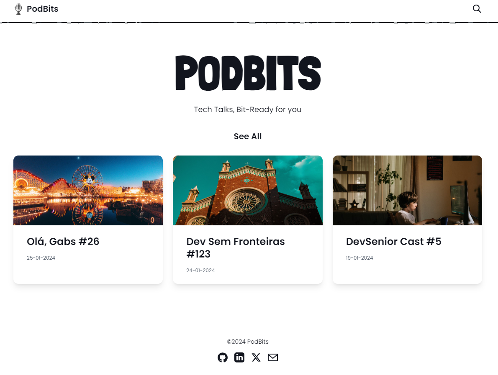

## PodBits

#### Tech Talks, Bit-Ready for you
**PODBITS** shortens your favorite tech talks | Explore concise summaries of tech podcasts, providing bite-sized analyses for quick insights.

----

O PodBits é um projeto pessoal, mantido por mim, e, assim como "todos os caminhos levam a Roma", tudo relacionado a ele envolve o meu aprendizado e a implementação de ideias e novas ferramentas.

A ideia do PodBits surgiu após uma conversa com o [Sibelius](https://twitter.com/sseraphini), onde eu explicava a ele o processo de criação de um dos meus artigos. Este artigo estava relacionado a uma tech talk que ele havia apresentado, e um de seus objetivos era ser uma forma de preservar parte daquele conhecimento. No artigo, eu destacava um dos trechos que mais me marcaram, e ao compartilhar isso com ele, surgiu o questionamento: `"Por que não criar TL;DRs de Tech Talks e Podcasts?"`.

**Too Long, Didn't Read** se tornou **Too Long, Didn't Listen**.

Esse foi o ponto de partida do PodBits, que se tornou uma maneira de armazenar o conteúdo de podcasts e tech talks de forma rápida e resumida, bem como oferecer uma nova alternativa para o consumo de conteúdo tech. **Por que gastar 50 minutos ouvindo um podcast, se é possível consumir esse conteúdo em menos de 10 minutos de leitura?** Por último, mas não menos importante, também se tornou uma forma de compartilhar publicamente o que estou aprendendo.

Tomei a decisão de usar principalmente `Astro.js`, pois, quando se trata de consumo em formato de leitura, nada supera um blog, e considerando que vejo o Astro como a melhor opção para a construção de blogs, ficou fácil decidir. Além do fato de que a documentação do Astro é extremamente bem feita, objetiva, simples e prática. Sendo assim, o PodBits é uma web page que possui a mesma estruturação de um blog, o que não apenas o torna prático e acessível, mas também facilmente manutenível.
